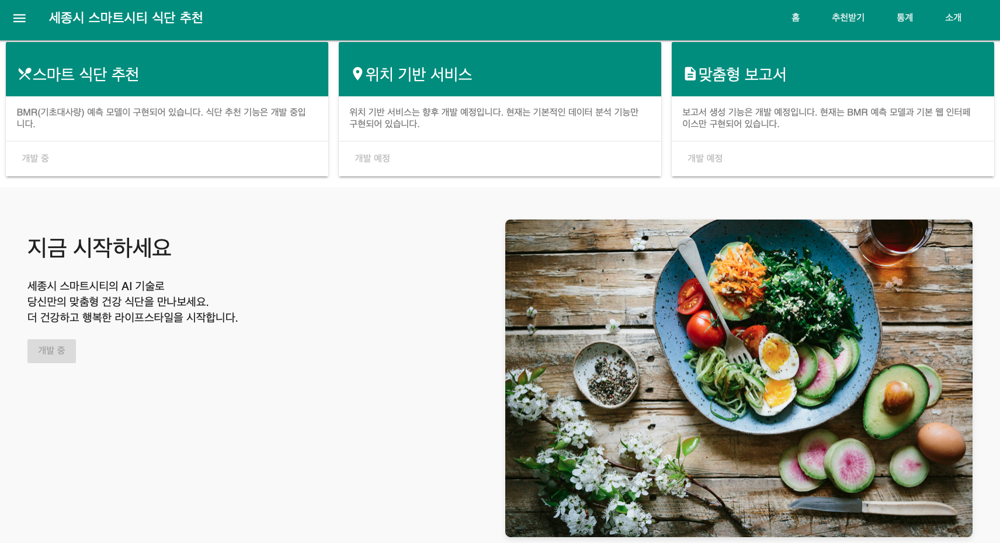

# 세종시 스마트시티 AI 다이어트 식단 추천 서비스

<!-- 기술 스택 뱃지 -->


<!-- 개발 상태 뱃지 -->




## 1. 프로젝트 개요

### 프로젝트 설명
- **명칭**: 세종시 스마트시티 헬스 데이터 기반 AI 다이어트 식단 추천 서비스 (개발 중)
- **목표**: AI 기반 개인 맞춤형 식단 추천 시스템 구축

### 현재 구현 상태
- ✅ **BMR(기초대사량) 예측 모델**: Random Forest 기반 (R² = 0.92)
- ✅ **웹 인터페이스**: FastAPI + Material Design 기본 UI
- ✅ **데이터 분석**: BMR 데이터셋 및 한국 식품영양 데이터 EDA
- 🚧 **식단 추천 시스템**: 개발 예정
- 🚧 **MLOps 파이프라인**: 기본 구조만 설정됨

### 구현된 머신러닝 기능
## 🧠 현재 구현된 ML 기능

|기능|상태|데이터셋|알고리즘|성능|
|---|---|---|---|---|
|**BMR 예측**|✅ 완료|9,000개 사용자 BMR 데이터|Random Forest|R² = 0.92, RMSE = 56.22|

## 📦 사용 중인 데이터셋

|데이터셋|내용|크기|활용 현황|
|---|---|---|---|
|**BMR_Dataset.csv**|사용자별 나이, 체중, 키, 성별, BMR|9,000 records|✅ 모델 학습 완료|
|**한국 식품영양성분 데이터**|식품별 영양소 정보|대용량|✅ EDA 완료, 모델 대기|


## 2. 기술 스택

### 백엔드
- **Framework**: FastAPI
- **AI/ML**: 
  - ✅ Random Forest (BMR 예측)
  - 🚧 LightGBM (식단 추천 - 개발 예정)
  - 🚧 KNN (유사 레시피 추천 - 개발 예정)

### MLOps (기본 구조만 설정)
- **데이터 버전 관리**: 🚧 DVC (설정만 완료)
- **실험 관리**: 🚧 MLflow (미구현)
- **모니터링**: 🚧 Prometheus + Grafana (미구현)

### 프론트엔드
- **UI**: Material Design Lite
- **템플릿 엔진**: Jinja2

### 현재 사용 중인 데이터
- BMR 데이터셋 (9,000 records)
- 한국 식품영양성분 정보 (식품의약품안전처)

## 3. 설치 및 실행

### 환경 설정
```bash
# 저장소 클론
git clone https://github.com/lhg96/sejong-diet-recommender.git
cd sejong-diet-recommender

# 가상환경 설정
python3 -m venv .venv
source .venv/bin/activate

# 의존성 설치
pip install -r requirements.txt
```

### 서버 실행
```bash
# FastAPI 서버 실행
python run.py
```

웹 브라우저에서 `http://localhost:8000`으로 접속하여 기본 UI를 확인할 수 있습니다.

## 4. 현재 구현 상태

### API 엔드포인트
- ✅ `GET /`: 메인 페이지
- 🚧 `POST /recommend`: 식단 추천 API (미구현)
- 🚧 `GET /report/{user_id}`: 리포트 생성 (미구현)

### 데이터 분석
- ✅ BMR 예측 모델 (`eda/bmr_analysis.ipynb`)
- ✅ 한국 식품영양 데이터 EDA (`eda/koreaFDA_EDA.ipynb`)

### 다음 개발 단계
1. BMR 모델을 활용한 칼로리 계산 API 구현
2. 식품 데이터를 활용한 기본 식단 추천 기능
3. 사용자 입력 폼 및 결과 표시 UI 개발

## 5. 프로젝트 구조
```
sejong-diet-recommender/
├── data/                   # 데이터 저장소
│   ├── BMR_Dataset.csv    # BMR 데이터 (9,000 records)
│   └── wellbeingfood/     # 한국 식품영양 데이터
├── eda/                   # 데이터 분석 노트북
│   ├── bmr_analysis.ipynb # BMR 모델 개발
│   └── koreaFDA_EDA.ipynb # 식품 데이터 분석
├── src/api/               # FastAPI 웹 서버
│   ├── main.py           # 메인 서버
│   ├── templates/        # HTML 템플릿
│   └── static/          # CSS, 이미지
├── models/                # 모델 저장소 (현재 비어있음)
├── mlops/                 # MLOps 설정 (기본 구조만)
└── run.py                # 서버 실행 스크립트
```

## 6. 스크린샷

### 메인 페이지
현재 구현된 웹 인터페이스의 모습입니다:


**주요 특징:**
- Material Design Lite 기반의 깔끔한 UI
- 반응형 디자인으로 다양한 화면 크기 지원
- 현재 개발 상태를 명확히 표시 (개발 중/개발 예정)
- 3개의 주요 기능 카드로 서비스 소개

**현재 상태:**
- ✅ **스마트 식단 추천**: BMR 모델 구현 완료, UI는 개발 중
- 🚧 **위치 기반 서비스**: 개발 예정
- 🚧 **맞춤형 보고서**: 개발 예정

**접속 방법:**
```bash
# 서버 실행
python run.py

# 브라우저에서 접속
http://localhost:8000
```

## 7. 개발 로드맵

### 단기 목표 (1-2주)
1. BMR 모델을 API로 연동
2. 사용자 정보 입력 폼 구현
3. 기본 칼로리 계산 기능

### 중기 목표 (1개월)
1. 식품 데이터를 활용한 간단한 식단 추천
2. 결과 표시 UI 개선
3. 기본적인 데이터 검증 로직

### 장기 목표 (3개월+)
1. 고도화된 식단 추천 알고리즘
2. MLOps 파이프라인 구축
3. 위치 기반 서비스 연동

## 8. 라이선스
MIT License

## 📞 문의하기

[](mailto:hyun.lim@okkorea.net)
[](https://www.okkorea.net)

개발 관련 컨설팅 및 외주 받습니다.

프로젝트 관리자 연락처:
- name: 임현근 (Hyun-Keun Lim)
- Email: hyun.lim@okkorea.net
- homepage: https://www.okkorea.net

---
